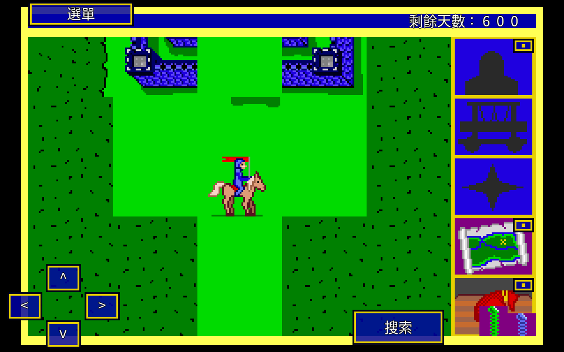
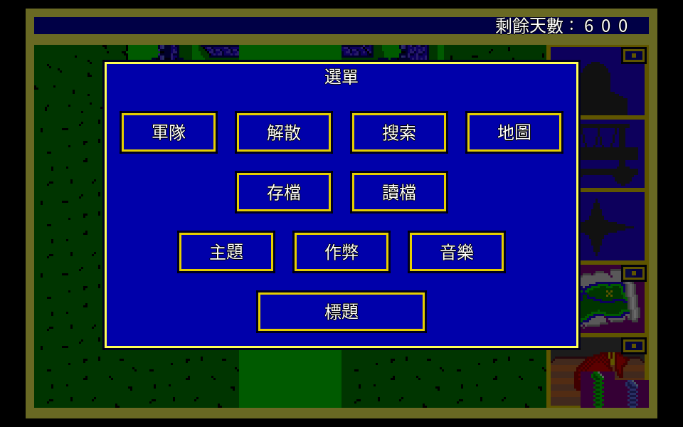
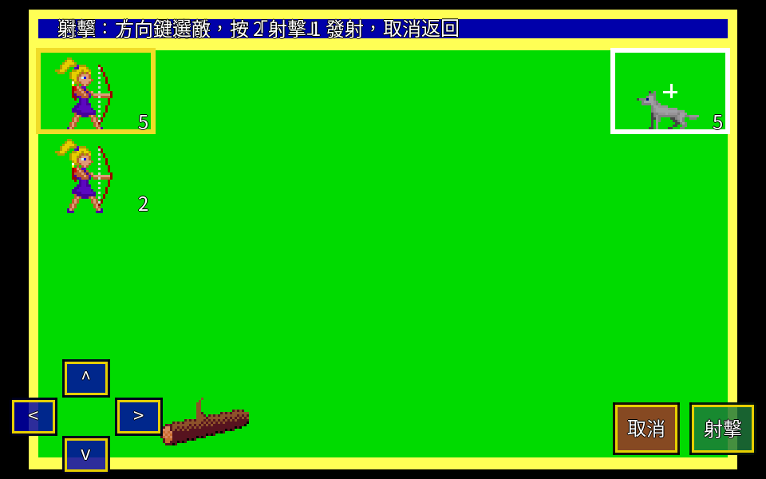
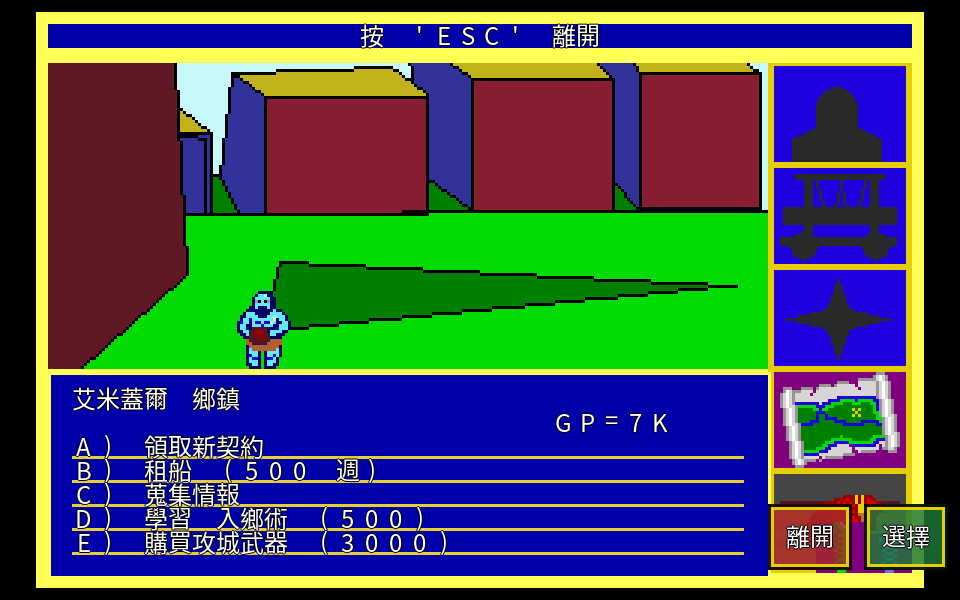

# open-king-bounty-go

**《御封戰將》(King's Bounty)——一款 1990 年首發、隔年登上 DOS 的策略 RPG,用 Go 重寫一遍,放回你今天的手機上。**



三十多年前,你在 14 吋 CRT 前騎著馬走過這張地圖,招兵、追捕惡棍、翻出藏起來的權杖。那是 New World Computing 後來《魔法門》系列的原型,也是「英雄無敵」戰棋的祖師爺。它值得被記得,更值得能繼續玩——在沒有 DOSBox、不必翻出老主機的今天,直接在手機上點開就能玩。

這個專案做兩件事:**用純 Go + [Ebiten](https://ebitengine.org) 把它乾淨重寫一遍**,一份原始碼同時出 Android / Windows / macOS / Linux / Web;以及**完整繁體中文化**,連遊戲內建的懸賞公告、路標、國王對話都翻過來。

---

## 這是什麼

不是模擬器,也不是把舊 C 程式包一層殼。這是**照著行為規格重新實作**的移植:

- **一份碼,全平台**。Ebiten 是純 Go 的 2D 引擎,同一份程式編出 Android / Windows / macOS / Linux,還能編成 Web (WASM) 在瀏覽器跑。Android 版是純 Go,不背 C runtime、不依賴 glibc。
- **C 版當「行為真值」**。[`openkb-cht`](https://github.com/wicanr2/open-king-bounty-cht)(C 版 openkb)把原版的資料格式與遊戲公式都破解摸透了,這裡拿它當對照基準:招兵成長、寶箱掉落、戰鬥傷害、世界生成的每個亂數,都逐句對著 C 源碼重現,不是憑印象重做。
- **雙層中文渲染**。底層維持 320×200 的像素美術(那個年代的味道不能丟),中文字疊在高解析層上,所以文字銳利、美術復古,兩者不打架。
- **四套可切換美術**。DOS、Genesis(Sega MD)、Amiga、free(開放美術),執行期一鍵切換;配 FM Towns 版的 BGM。

## 特色一覽

| 面向 | 內容 |
|---|---|
| 遊戲完整度 | 從新遊戲玩到通關的核心循環全通:選角 → 世界地圖 → 城鎮 / 城堡 / 棲地招兵 → 戰鬥(含施法、圍攻奪城)→ 契約履約 → 尋權杖破關 |
| 平台 | Android(第一目標)、Windows、macOS、Linux、Web(WASM) |
| 中文化 | 介面、選單、懸賞公告、路標、國王對話全繁中;雙層渲染保住像素美術 |
| 美術主題 | DOS / Genesis / Amiga / free 執行期切換,資料層不動、只換美術 PNG |
| 音樂 | FM Towns 版 BGM,依畫面(地圖 / 戰鬥 / 城鎮 / 城堡 / 標題)自動切曲 |
| 觸控 | 為手機重新設計的整套觸控操作(見下節) |

## 讓鍵盤老遊戲,用今天的方式玩

《御封戰將》原本是鍵盤遊戲——移動靠方向鍵,選單靠按 A 到 E,確認 / 取消靠 Enter 和 ESC。要把它搬上手機,難的不是編譯,是**把三十年前的鍵盤操作,翻成拇指在螢幕上點得順的動作**。這是這個專案花最多心思的地方。

**完整觸控,不必外接鍵盤。** 左下角一組螢幕方向鍵(D-pad),右下角確認 / 取消鈕,地圖走位、清單上下、戰鬥移動全靠它。滑動也能當方向用,兩種手感可選。

**一顆「選單」鈕收起所有動作。** 世界地圖頂端有顆「選單」鈕,點開就是完整的動作清單——存讀檔、軍隊、角色、搜索、地圖、換洲、切主題、作弊、音樂、回標題。這貼近原版「一鍵叫出選單」的手感,又把主畫面整個讓給地圖,不被一排按鈕擠掉。



**右側面板本身就是按鈕。** 契約、魔法、拼圖、錢袋四塊面板可以直接點——點什麼看什麼,角落有可點的小徽章提示。不用先記快捷鍵,想看哪塊點哪塊。

**戰鬥能純觸控打完。** 弓兵射擊時,用方向鍵把目標游標移到敵人身上,按「射擊」發射;近戰走位、施法選格,全部點得到。城鎮、招兵這類選單畫面,選項直接點那一行就選它。



**觸控鈕長得像遊戲的一部分。** 按鈕和外框都沿用 C 版那套「金色浮雕框 + 深藍底」的視覺語言,不是外掛上去的醜方塊。橫向擺放、拇指熱區安排在左下(方向)和右下(確認 / 取消),盡量少擋地圖,畫面乾淨。



> 目標很簡單:讓一款 1991 年的經典,在現代手機上活過來,而且是用今天玩家習慣的方式玩。

## 為什麼重寫,而不是移植舊碼

- **記憶體安全**。C 版半年間修過的 NULL 解參考、文字讀取錯位、資料路徑重複等問題,在 Go 的型別與結構下不會發生。
- **好測**。遊戲邏輯和畫面渲染分開,邏輯層可以在沒有顯示卡的環境下跑,直接對 C 版的行為做逐項比對。
- **不用維護雙軌**。純 Go 靠 `ebitenmobile bind` 出 Android,不必再維護「SDL2 桌面 + NDK + 觸控 overlay」兩套東西。

重寫計畫全文見 `openkb-cht` 的 `docs/rewrite-go-ebiten.md`;移植進度與逐畫面對照見本專案 `docs/PORT-STATUS.md`。

## 建置與執行

```sh
go test ./internal/...      # 邏輯層(無需 GL,快)
go build ./cmd/openkb       # 桌面(需 GL / X11 開發標頭)
ebitenmobile bind -target android -o openkb.aar ./mobile   # Android AAR
```

桌面試玩(free 美術、直接建角進世界地圖):

```sh
./openkb -datadir internal/embedded/data -theme free -startclass 0
```

## 架構

`internal/` 按功能垂直切,邏輯與渲染分離:

| 套件 | 職責 |
|---|---|
| `kbrng` | glibc `rand()` 的純 Go 重現(對齊 C 亂數的錨點) |
| `kbdata` | 資料層:讀解所有格式 → 唯讀 `Assets` |
| `gamestate` | 純遊戲狀態與規則(領導力 / 寶箱 / 招兵 / 晉升),無渲染、可 headless |
| `combat` | 戰鬥狀態機 + AI,無渲染 |
| `render` | Ebiten 繪製(世界地圖 / 戰鬥 / UI / 中文字),只讀狀態 |
| `input` | 桌面鍵盤 + 手機觸控 → 同一套 Action |
| `screen` | 畫面流程狀態機 |
| `save` `audio` | 跨平台存讀檔 / BGM |

## 美術與音樂版權

- **free 開放美術與開放資料**:自由公開,隨 repo 附上。本 README 的截圖全部用 free 主題。
- **原版 DOS / Genesis / Amiga 美術、FM Towns 音樂**:屬原作版權,只供**擁有正版的玩家**在自己機器上 build 時內建,本專案不散布;公開 repo 與對外 APK 一律不含這些素材。

## 授權

沿用 `openkb-cht` 的授權政策:程式碼與 free 素材開放,原版美術 / 音樂依上節版權政策處理。
